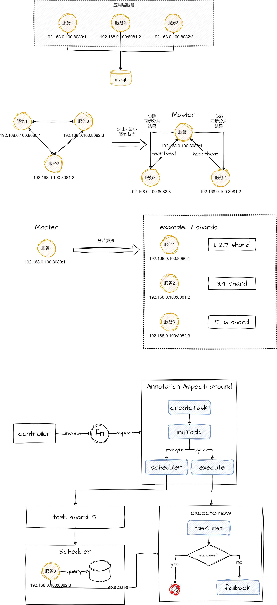

## 1、执行流程图



## 2、使用场景

- 用于保证某个操作一定成功，最终一致。

## 3、数据库脚本

### 3.1、单库单任务表的数据库脚本

> 在所在服务的数据库中加入该表即可，如果需要分库，在每个库中创建一份即可

```SQL
CREATE
DATABASE `consistency_task` CHARACTER SET 'utf8mb4' COLLATE 'utf8mb4_general_ci';

USE
`consistency_task`;

CREATE TABLE `consistency_task`
(
    `id`                     bigint                                                        NOT NULL AUTO_INCREMENT COMMENT '主键自增',
    `task_id`                varchar(500) CHARACTER SET utf8mb4 COLLATE utf8mb4_general_ci NOT NULL COMMENT '用户自定义的任务名称，如果没有则使用方法签名',
    `task_status`            int                                                           NOT NULL DEFAULT '0' COMMENT '执行状态',
    `execute_times`          int                                                           NOT NULL COMMENT '执行次数',
    `execute_time`           bigint                                                        NOT NULL COMMENT '执行时间',
    `parameter_types`        varchar(255) CHARACTER SET utf8mb4 COLLATE utf8mb4_general_ci NOT NULL COMMENT '参数的类路径名称',
    `method_name`            varchar(100) CHARACTER SET utf8mb4 COLLATE utf8mb4_general_ci NOT NULL COMMENT '方法名',
    `method_sign_name`       varchar(200) CHARACTER SET utf8mb4 COLLATE utf8mb4_general_ci NOT NULL DEFAULT '' COMMENT '方法签名',
    `execute_interval_sec`   int                                                           NOT NULL DEFAULT '60' COMMENT '执行间隔秒',
    `delay_time`             int                                                           NOT NULL DEFAULT '60' COMMENT '延迟时间：单位秒',
    `task_parameter`         varchar(200) CHARACTER SET utf8mb4 COLLATE utf8mb4_general_ci NOT NULL DEFAULT '' COMMENT '任务参数',
    `execute_way`            int                                                           NOT NULL COMMENT '执行模式：1、立即执行 2、调度执行',
    `thread_way`             int                                                           NOT NULL COMMENT '线程模型 1、异步 2、同步',
    `error_msg`              varchar(200) CHARACTER SET utf8mb4 COLLATE utf8mb4_general_ci NOT NULL DEFAULT '' COMMENT '执行的error信息',
    `alert_expression`       varchar(100) CHARACTER SET utf8mb4 COLLATE utf8mb4_general_ci          DEFAULT NULL COMMENT '告警表达式',
    `alert_action_bean_name` varchar(255) CHARACTER SET utf8mb4 COLLATE utf8mb4_general_ci          DEFAULT NULL COMMENT '告警逻辑的的执行beanName',
    `fallback_class_name`    varchar(255) CHARACTER SET utf8mb4 COLLATE utf8mb4_general_ci          DEFAULT NULL COMMENT '降级逻辑的的类路径',
    `fallback_error_msg`     varchar(200) CHARACTER SET utf8mb4 COLLATE utf8mb4_general_ci          DEFAULT NULL COMMENT '降级失败时的错误信息',
    `shard_key`              bigint                                                                 DEFAULT '0' COMMENT '任务分片键',
    `gmt_create`             datetime                                                      NOT NULL COMMENT '创建时间',
    `gmt_modified`           datetime                                                      NOT NULL COMMENT '修改时间',
    PRIMARY KEY (`id`),
    UNIQUE KEY `uk_id_shard_key` (`id`,`shard_key`) USING BTREE
) ENGINE=InnoDB DEFAULT CHARSET=utf8mb4 COLLATE=utf8mb4_general_ci;
```

### 3.2、多库每个库一个任务表的数据库脚本

> （这里以2库每个库一张任务表举例）

```sql
CREATE
DATABASE `consistency_task0` CHARACTER SET 'utf8mb4' COLLATE 'utf8mb4_general_ci';

USE
`consistency_task0`;

CREATE TABLE `consistency_task`
(
    `id`                     bigint                                                        NOT NULL AUTO_INCREMENT COMMENT '主键自增',
    `task_id`                varchar(500) CHARACTER SET utf8mb4 COLLATE utf8mb4_general_ci NOT NULL COMMENT '用户自定义的任务名称，如果没有则使用方法签名',
    `task_status`            int                                                           NOT NULL DEFAULT '0' COMMENT '执行状态',
    `execute_times`          int                                                           NOT NULL COMMENT '执行次数',
    `execute_time`           bigint                                                        NOT NULL COMMENT '执行时间',
    `parameter_types`        varchar(255) CHARACTER SET utf8mb4 COLLATE utf8mb4_general_ci NOT NULL COMMENT '参数的类路径名称',
    `method_name`            varchar(100) CHARACTER SET utf8mb4 COLLATE utf8mb4_general_ci NOT NULL COMMENT '方法名',
    `method_sign_name`       varchar(200) CHARACTER SET utf8mb4 COLLATE utf8mb4_general_ci NOT NULL DEFAULT '' COMMENT '方法签名',
    `execute_interval_sec`   int                                                           NOT NULL DEFAULT '60' COMMENT '执行间隔秒',
    `delay_time`             int                                                           NOT NULL DEFAULT '60' COMMENT '延迟时间：单位秒',
    `task_parameter`         varchar(200) CHARACTER SET utf8mb4 COLLATE utf8mb4_general_ci NOT NULL DEFAULT '' COMMENT '任务参数',
    `execute_way`            int                                                           NOT NULL COMMENT '执行模式：1、立即执行 2、调度执行',
    `thread_way`             int                                                           NOT NULL COMMENT '线程模型 1、异步 2、同步',
    `error_msg`              varchar(200) CHARACTER SET utf8mb4 COLLATE utf8mb4_general_ci NOT NULL DEFAULT '' COMMENT '执行的error信息',
    `alert_expression`       varchar(100) CHARACTER SET utf8mb4 COLLATE utf8mb4_general_ci          DEFAULT NULL COMMENT '告警表达式',
    `alert_action_bean_name` varchar(255) CHARACTER SET utf8mb4 COLLATE utf8mb4_general_ci          DEFAULT NULL COMMENT '告警逻辑的的执行beanName',
    `fallback_class_name`    varchar(255) CHARACTER SET utf8mb4 COLLATE utf8mb4_general_ci          DEFAULT NULL COMMENT '降级逻辑的的类路径',
    `fallback_error_msg`     varchar(200) CHARACTER SET utf8mb4 COLLATE utf8mb4_general_ci          DEFAULT NULL COMMENT '降级失败时的错误信息',
    `shard_key`              bigint                                                                 DEFAULT '0' COMMENT '任务分片键',
    `gmt_create`             datetime                                                      NOT NULL COMMENT '创建时间',
    `gmt_modified`           datetime                                                      NOT NULL COMMENT '修改时间',
    PRIMARY KEY (`id`),
    UNIQUE KEY `uk_id_shard_key` (`id`,`shard_key`) USING BTREE
) ENGINE=InnoDB DEFAULT CHARSET=utf8mb4 COLLATE=utf8mb4_general_ci;

CREATE
DATABASE `consistency_task1` CHARACTER SET 'utf8' COLLATE 'utf8mb4_general_ci';

USE
`consistency_task1`;

CREATE TABLE `consistency_task`
(
    `id`                     bigint                                                        NOT NULL AUTO_INCREMENT COMMENT '主键自增',
    `task_id`                varchar(500) CHARACTER SET utf8mb4 COLLATE utf8mb4_general_ci NOT NULL COMMENT '用户自定义的任务名称，如果没有则使用方法签名',
    `task_status`            int                                                           NOT NULL DEFAULT '0' COMMENT '执行状态',
    `execute_times`          int                                                           NOT NULL COMMENT '执行次数',
    `execute_time`           bigint                                                        NOT NULL COMMENT '执行时间',
    `parameter_types`        varchar(255) CHARACTER SET utf8mb4 COLLATE utf8mb4_general_ci NOT NULL COMMENT '参数的类路径名称',
    `method_name`            varchar(100) CHARACTER SET utf8mb4 COLLATE utf8mb4_general_ci NOT NULL COMMENT '方法名',
    `method_sign_name`       varchar(200) CHARACTER SET utf8mb4 COLLATE utf8mb4_general_ci NOT NULL DEFAULT '' COMMENT '方法签名',
    `execute_interval_sec`   int                                                           NOT NULL DEFAULT '60' COMMENT '执行间隔秒',
    `delay_time`             int                                                           NOT NULL DEFAULT '60' COMMENT '延迟时间：单位秒',
    `task_parameter`         varchar(200) CHARACTER SET utf8mb4 COLLATE utf8mb4_general_ci NOT NULL DEFAULT '' COMMENT '任务参数',
    `execute_way`            int                                                           NOT NULL COMMENT '执行模式：1、立即执行 2、调度执行',
    `thread_way`             int                                                           NOT NULL COMMENT '线程模型 1、异步 2、同步',
    `error_msg`              varchar(200) CHARACTER SET utf8mb4 COLLATE utf8mb4_general_ci NOT NULL DEFAULT '' COMMENT '执行的error信息',
    `alert_expression`       varchar(100) CHARACTER SET utf8mb4 COLLATE utf8mb4_general_ci          DEFAULT NULL COMMENT '告警表达式',
    `alert_action_bean_name` varchar(255) CHARACTER SET utf8mb4 COLLATE utf8mb4_general_ci          DEFAULT NULL COMMENT '告警逻辑的的执行beanName',
    `fallback_class_name`    varchar(255) CHARACTER SET utf8mb4 COLLATE utf8mb4_general_ci          DEFAULT NULL COMMENT '降级逻辑的的类路径',
    `fallback_error_msg`     varchar(200) CHARACTER SET utf8mb4 COLLATE utf8mb4_general_ci          DEFAULT NULL COMMENT '降级失败时的错误信息',
    `shard_key`              bigint                                                                 DEFAULT '0' COMMENT '任务分片键',
    `gmt_create`             datetime                                                      NOT NULL COMMENT '创建时间',
    `gmt_modified`           datetime                                                      NOT NULL COMMENT '修改时间',
    PRIMARY KEY (`id`),
    UNIQUE KEY `uk_id_shard_key` (`id`,`shard_key`) USING BTREE
) ENGINE=InnoDB DEFAULT CHARSET=utf8mb4 COLLATE=utf8mb4_general_ci;
```

## 4、在启动类中加入EnableTendConsistencyTask注解

```
@EnableTendConsistencyTask
```

## 5、在需要的方法上加入@ConsistencyTask注解

eg:

```
/**
 * 发送支付订单超时延迟消息，用于支付超时自动关单
 */
@ConsistencyTask(
								executeMode = ExecuteModeEnum.EXECUTE_SCHEDULE, 
                threadMode = ThreadModeEnum.THREAD_MODEL_ASYNC, 
                transactionMode = TransactionModeEnum.WITH_TRANSACTION)
public void sendyMessage(CreateOrderRequest createOrderRequest) {
    
}
```

> 注意：因为框架是基于AOP的，因此注解只能加到public的方法上，建议所有发消息的组件放到一个类中，或者做一个发消息的接口，统一管理发消息的方法

### 5.1、注解参数说明：

##### 注解属性说明：

- executeIntervalSec：时间单位秒，发送消息的间隔
- delayTime：时间单位秒，第一次发消息的时候，需要延迟多少秒再进行发送，比如要发送延迟消息，比如要半小时后发送，那么就写1800。并且executeMode的值使用EXECUTE_SCHEDULE。
- executeMode：调度模式，可选值:EXECUTE_RIGHT_NOW(1, "立即执行")， EXECUTE_SCHEDULE(2, "调度执行")
- threadMode：任务执行的线程模型，可选值有：THREAD_MODEL_ASYNC(1, "异步执行")、THREAD_MODEL_SYNC(2, "同步执行")
- transactionMode：WITH_TRANSACTION(1, "事务方式执行")、WITHOUT_TRANSACTION(2, "非事务方式执行")
  默认值就是事务方式执行任务，非事务方式尽量别用，没有保障。
- fallbackClass：当方法执行动作失败的时候，触发降级逻辑。触发逻辑需要结合配置文件中的配置。
- alertExpression：告警表达式，当任务失败且满足该表达式，会执行告警通知。
- alertActionBeanName：实现告警通知相关逻辑的spring bean，该bean需要实现，ConsistencyFrameworkAlerter接口中的方法，来实现具体的告警逻辑，框架会进行调用。

##### 告警通知的说明：

> 1、配置了降级类的告警逻辑
> 如果配置了降级类，则会先进行原逻辑的调度用，调用失败，满足降级配置，则会降级。
> 如果一次调用中，正常逻辑失败，降级也失败，满足告警条件则会进行告警。
> 2、没有配置降级类的告警逻辑
> 如果没有配置降级类，只要满足告警表达式就会进行告警。

```
EXECUTE_RIGHT_NOW(1, "立即执行"),
EXECUTE_SCHEDULE(2, "调度执行");
```

###### EXECUTE_RIGHT_NOW: 表示任务会被框架立即执行。

######   

###### EXECUTE_SCHEDULE表示，任务下发后，不会执行，需要业务服务中的定时任务来进行调度。